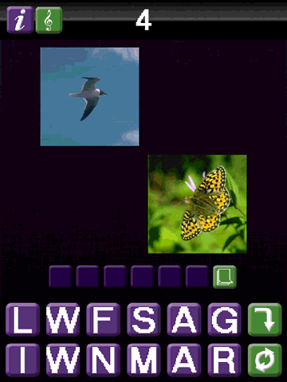

# LIKENESS

Written in App Game Kit Classic (v1.7), LIKENESS was heavily inspired by the game [4 Pics 1 Word](https://en.wikipedia.org/wiki/4_Pics_1_Word). 

The game has 70 rounds. For each round, players start by spelling a word that describes two images. When the right word is chosen, a third image is added and the players must guess again. This continues on with a fourth image, and then a new round is started. 

## Screenshots

## License

Due to licensing issues, some sound effects have been replaced with public domain alternatives.

This work is licensed under a
[Creative Commons Attribution-ShareAlike 4.0 International License][cc-by-sa].

[![CC BY-SA 4.0][cc-by-sa-image]][cc-by-sa]

[cc-by-sa]: http://creativecommons.org/licenses/by-sa/4.0/
[cc-by-sa-image]: https://licensebuttons.net/l/by-sa/4.0/88x31.png
[cc-by-sa-shield]: https://img.shields.io/badge/License-CC%20BY--SA%204.0-lightgrey.svg